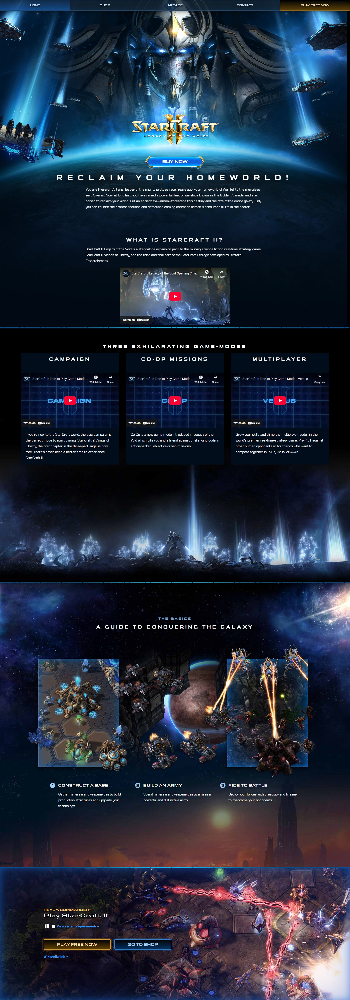
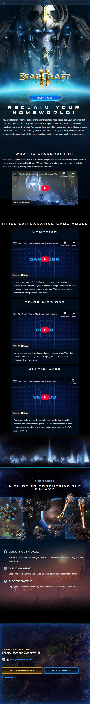

# StarCraft II Legacy of the Void - Promotional Website

A responsive promotional website for StarCraft II: Legacy of the Void built with Angular 7. This project showcases the game's features, campaigns, and commanders with an immersive user experience featuring video backgrounds and interactive elements.

Shop page and an overall improved version can be found here https://github.com/ymebrugts/frontend-iprwc and https://github.com/ymebrugts/backend-iprwc

## 📸 Screenshots

### Desktop View


### Mobile View


## 🚀 Features

- **Responsive Design** - Optimized for desktop and mobile devices
- **Interactive Homepage** - Video backgrounds, game information, and YouTube embeds
Created to show visual capabilities, updated to be a public repo instead.


## 🛠️ Tech Stack

- **Frontend Framework**: Angular 7
- **Language**: TypeScript
- **Styling**: CSS3 with custom animations
- **Build Tool**: Angular CLI
- **Testing**: Jasmine, Karma, Protractor
- **Node.js**: Version 12.x (required for compatibility)

## ⚠️ Prerequisites

- **Node.js 12.x** - This project requires Node.js version 12.x for compatibility with Angular 7
- **Angular CLI 7.x** - Install the correct version: `npm install -g @angular/cli@7.1.0`
- **npm** - Package manager (comes with Node.js)

> **Note**: Using newer Node.js versions (17+) may cause compatibility issues. If you encounter `http_parser` errors, please downgrade to Node.js 12.x.

## 📦 Installation

1. **Clone the repository**
```bash
git clone https://github.com/ymebrugts/StarCraft-ipwrc.git
cd StarCraft-ipwrc
```

2. **Switch to Node.js 12.x (if using nvm)**
```bash
nvm use 12.22.12
# or install if not available
nvm install 12.22.12
nvm use 12.22.12
```

3. **Install Angular CLI 7.x**
```bash
npm install -g @angular/cli@7.1.0
```

4. **Install dependencies**
```bash
npm install
```

5. **Start the development server**
```bash
ng serve
```

6. **Navigate to `http://localhost:4200/`** to view the application

## 🏗️ Build

```bash
# Development build
ng build

# Production build
ng build --prod
```

## 🧪 Testing

```bash
# Unit tests
ng test

# End-to-end tests
ng e2e
```

## 📱 Pages

- **Home** - Game overview, features, and gameplay modes
- **Shop** - Campaign and commander purchasing
- **Navigation** - Responsive menu with external links

## 🎮 Game Information

The website promotes StarCraft II: Legacy of the Void, featuring:
- Three game modes: Campaign, Co-op Missions, and Multiplayer
- Available campaigns: Wings of Liberty, Heart of the Swarm, Legacy of the Void
- Commander characters: Abathur, Alarak, Fenix

## 📄 License

This project is for educational and promotional purposes. StarCraft II is a trademark of Blizzard Entertainment.

---

*Built with ❤️ using Angular*